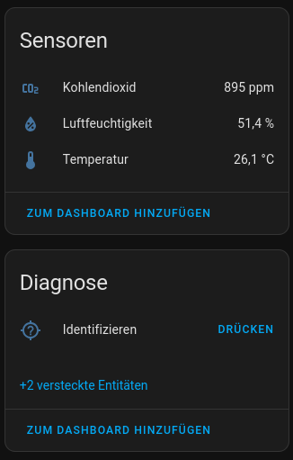

# ESP32-H2/C6 CO2 Zigbee Device

This project is a Zigbee device based on the ESP32-H2 / ESP32-C6 that can read CO2 sensor values from a sensirion SCD-4X based sensor via i2c.

Power saving features are not implemented. So this is not suitable for operating on battery power at this point.

## Features

- [x] SCD-4X temperature sensor
- [x] SCD-4X humidity sensor
- [x] SCD-4X CO2 sensor

## Hardware

- [ESP32-H2](https://www.espressif.com/en/products/socs/h2/overview)
- [ESP32-C6](https://www.espressif.com/en/products/socs/c6/overview)
- [Sensirion SCD-41](https://sensirion.com/products/catalog/SCD41)

## GPIO

| GPIO   | Function              |
| ------ | --------------------- |
| GPIO22 | I2C SDA to SCD-41     |
| GPIO23 | I2C SCL to SCD-41     |

# Credits

Thanks to @xmow49 for his [zigbee demo sensor repository](https://github.com/xmow49/ESP32H2-Zigbee-Demo).
The code in this repository is based on his implementation with some significant modifications
