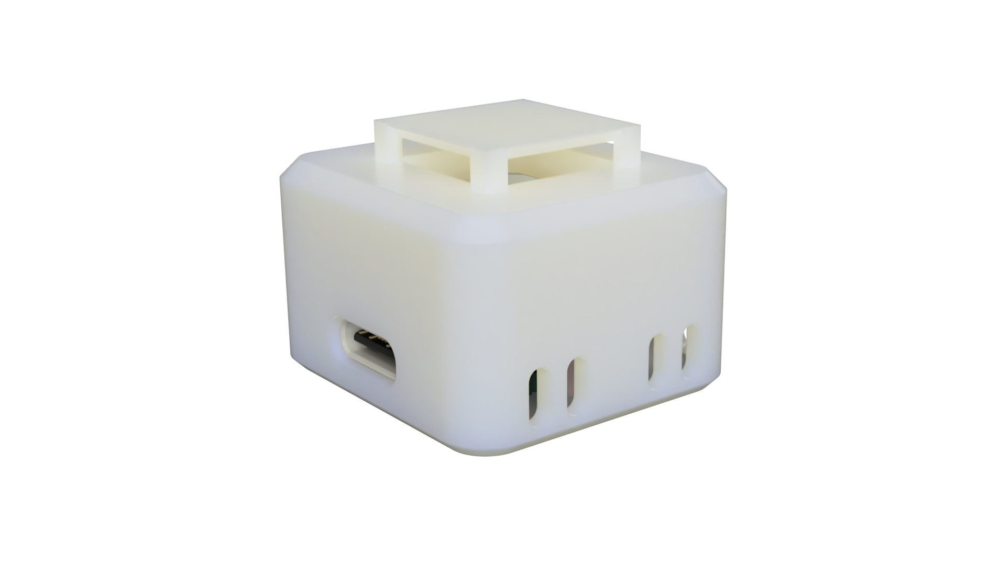
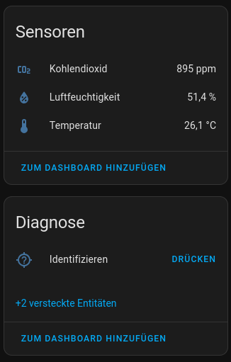
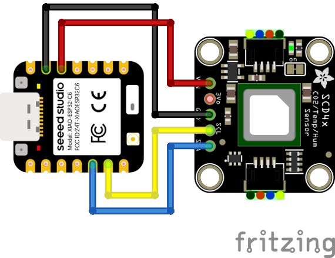
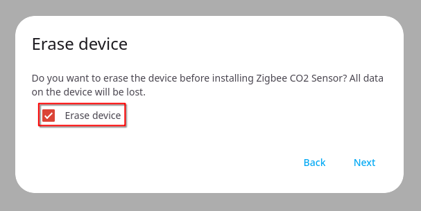

# CO2 Zigbee sensor

This project is a Zigbee device based on the ESP32-H2 / ESP32-C6 that can read CO2 sensor values from a Sensirion SCD-4X based sensor via i2c.

The aim of this project is to provide a "pug-and-play" experience for building such a sensor and should be very easy to replicate.
To make building this as easy as possible a full list of step-by-step instructions is provided and firmware for the chips is precompiled and can be flashed via a web browser.

---

#### ⚠️ Disclaimer
The firmware for the H2 chip has not yet been tested and confirmed working

---

## Features

Once built the sensor will provide:

- Temperature
- Humidity
- CO2

These values are reported over zigbee every 5 minutes

Exposed values (example screenshot from Home Assistant ZHA):

## Hardware

This project comes bundled together with a ready made case that can be 3D-Printed.
The case and assembly instructions for it are provided on the [Printables page](https://www.printables.com/model/1036769-compact-co2-zigbee-sensor)

To be able to utilize the provided case the following components must be used:
- [Seeed Sudio XIAO-ESP32C6](https://www.seeedstudio.com/Seeed-Studio-XIAO-ESP32C6-p-5884.html)
- [Adafruit SCD-41](https://www.adafruit.com/product/5190)

If the case is not needed any variants/breakout boards that use the following components can be used with the provided firmware:
- [ESP32-H2](https://www.espressif.com/en/products/socs/h2/overview)
- [ESP32-C6](https://www.espressif.com/en/products/socs/c6/overview)
- [Sensirion SCD-41](https://sensirion.com/products/catalog/SCD41)

## GPIO

The firmware is configured to use the following PIO pins by default:

| GPIO   | Function              |
| ------ | --------------------- |
| GPIO22 | I2C SDA to SCD-41     |
| GPIO23 | I2C SCL to SCD-41     |

With the suggested breakout boards from above it would be wired up like this:

## Flashing

You can very easily flash the firmware using a handy web interface.
Simply go to the link below and click the connect button (note that you will have to use a supported browser for this to work):

[Web flash tool](https://florianl21.github.io/zigbee-co2-sensor/)

## Un-pairing/factory reset

The firmware does currently not have any mechanic to support factory resetting the device from a user perspective.
If the device it removed from the zigbee coordinator while the device is connected it is automatically un-paired and will go into a state where it is ready to be re-paired.
If for some reason this is not an option, you can just erase the devices entire flash effectively "factory resetting" it. This can also be done via the web interface by selecting the `Erase device` checkbox when flashing the firmware:

## Notes on power consumption

The firmware is quite okay with power consumption. On average the sensor will consume 2.5mWh (measured over the span of 14h).
This can be slightly reduced by disabling the onboard LED of the adafruit breakout board.

For now the firmware reports as being mains powered over zigbee as this is its intended use case.
Battery operation with such a low power draw is however totally feasible.
Further improvements could be made to the FW to lower the power consumption even more. For example:

- [ ] Increasing the `ED_KEEP_ALIVE` time to reduce the numbers of sleep wake-ups from the zigbee stack
- [ ] Currently the SCD-4x operates in a single shot operation mode which is quite low power but it has options for reducing the power consumption even further. For this to work a mechanic for custom calibration triggering would need to be implemented as in this low power mode autocalibration is not available.
- [ ] Increasing the polling frequency of the SCD-4x to some time span over 30 minutes would allow for the ESP to utilize deep sleep (Espressif recommends not using deep sleep with zigbee for sensors that send more frequently than once every 30 minutes as with deep sleep the zigbee stack must be re-initialized after every wakeup, thus this puts additional strain on the zigbee network itself)
- [ ] Utilize the low power core to communicate with the sensor via I2C and only wake up from sleep (or even deep sleep) when there was an actual significant value change from the last update that was sent

# Credits

Thanks to @xmow49 for his [zigbee demo sensor repository](https://github.com/xmow49/ESP32H2-Zigbee-Demo).
The code in this repository is based on his implementation with some significant modifications
