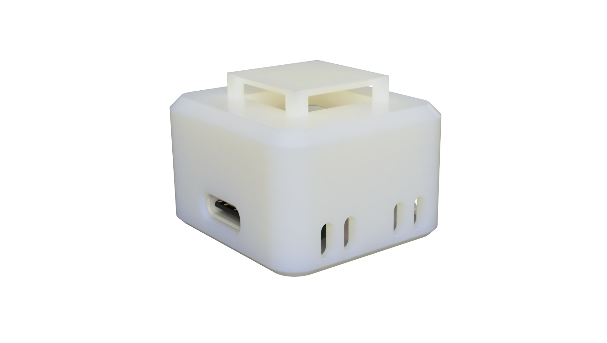
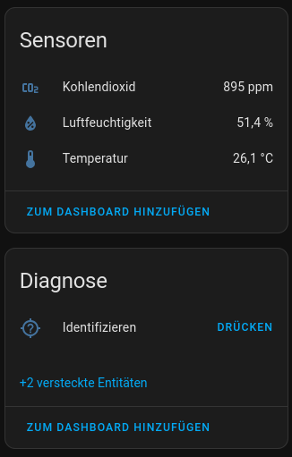
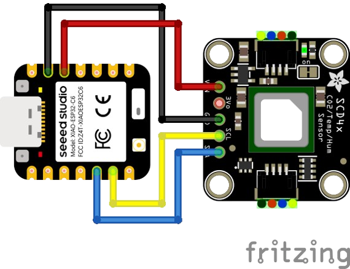
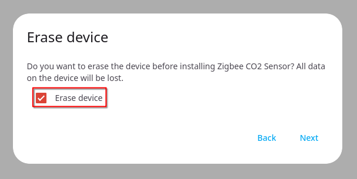

# CO2 Zigbee sensor

This project is a Zigbee device based on the ESP32-C6 that can read CO2 sensor values from a Sensirion SCD-4X based sensor via i2c.

The aim of this project is to provide a "pug-and-play" experience for building such a sensor and should be very easy to replicate.
To make building this as easy as possible a full list of step-by-step instructions is provided and firmware for the chips is precompiled and can be flashed via a web browser.

---

#### ⚠️ Disclaimer
The Battery powered firmware has not yet been tested and confirmed working

---

## Features

Once built the sensor will provide:

- Temperature
- Humidity
- CO2

These values are reported over zigbee every 5 minutes

Exposed values (example screenshot from Home Assistant ZHA):

## Hardware

This project comes bundled together with a ready made case that can be 3D-Printed.
The case and assembly instructions for it are provided on the [Printables page](https://www.printables.com/model/1036769-compact-co2-zigbee-sensor)

To be able to utilize the provided case the following components must be used:
- [Seeed Sudio XIAO-ESP32C6](https://www.seeedstudio.com/Seeed-Studio-XIAO-ESP32C6-p-5884.html)
- [Adafruit SCD-41](https://www.adafruit.com/product/5190)

If the case is not needed any variants/breakout boards that use the following components can be used with the provided firmware:
- [ESP32-C6](https://www.espressif.com/en/products/socs/c6/overview)
- [Sensirion SCD-41](https://sensirion.com/products/catalog/SCD41)

## GPIO

The firmware is configured to use the following PIO pins by default:

| GPIO   | Function              |
| ------ | --------------------- |
| GPIO22 | I2C SDA to SCD-41     |
| GPIO23 | I2C SCL to SCD-41     |

With the suggested breakout boards from above it would be wired up like this:

Please note that if you pan on using the included enclose you should solder your wires to the BACK of the sensors PCB!

## Flashing

You can very easily flash the firmware using a handy web interface.
Simply go to the link below and click the connect button (note that you will have to use a supported browser for this to work):

[Web flash tool](https://florianl21.github.io/zigbee-co2-sensor/)

If the flashing does not work you may already have a firmware on the device that puts the ESP into deep sleep (will also be the case if you try to update this firmware).
In such a case you will need to hold the boot button of the ESP before plugging it into USB to put it into download mode (or be very fast with clicking the buttons in the web interface right after plugging it in).

## Un-pairing/factory reset

The device can be factory reset b y holding the boot button for 3s after the sensor has booted up.

If the device it removed from the zigbee coordinator while the device is connected it is automatically un-paired and will go into a state where it is ready to be re-paired.

If for some reason none of these options work, you can just erase the devices entire flash effectively "factory resetting" it. This can also be done via the web interface by selecting the `Erase device` checkbox when flashing the firmware:

